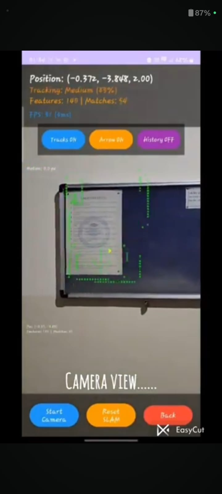
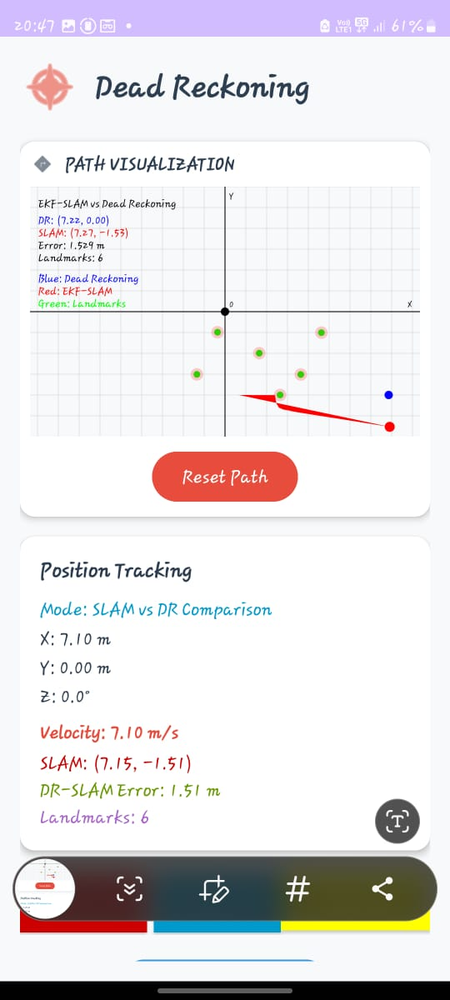
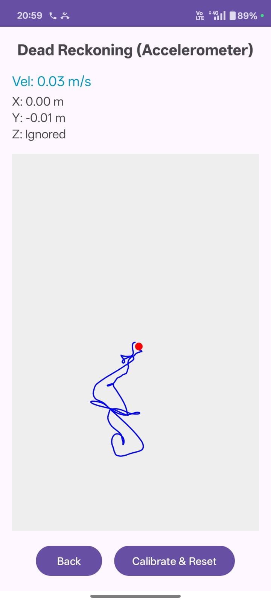

# 🚀 **DualTrack – Dead Reckoning vs EKF-SLAM on Mobile Devices**
### *IE-415 – Control of Autonomous Systems*  
📱 *A smartphone-based localization experiment*

---

## 👥 **Team Members**
- **Farhan Ansari** – 202301256  
- **Bhagya Majithiya** – 202301269  
- **Rajan Chauhan** – 202301427  
- **Mitwa Ninama** – 202301162  

---

## 🔗 **Project Links**
- **GitHub Repository:** https://github.com/BhagyaM1100/SLAMVSDR_CAS.git  
- **Demo Video:** https://youtu.be/QHmeINfgius  

---

# 📌 **Overview**

DualTrack is an Android application designed to compare **Dead Reckoning (DR)** and **EKF-SLAM** side-by-side using nothing more than a smartphone’s onboard sensors.

Where **Dead Reckoning** trusts only the IMU,  
**SLAM** combines motion with landmark observations to correct drift.

DualTrack visualizes both in real time, letting you watch:
- DR slowly drift away,
- SLAM snap back into place,
- and both methods try their best to understand where your phone really is.

This project demonstrates—in a compact, mobile form—the classic lesson from autonomous robotics:

> **Open-loop estimation drifts. Closed-loop SLAM survives.**

---

# 🔍 **Core Concepts**

## 🔵 **Dead Reckoning (DR)**  
Based purely on accelerometer + gyroscope readings.

The phone integrates acceleration twice:
```
v = v + a·Δt  
p = p + v·Δt  
θ = θ + gyro·Δt
```
even tiny noise becomes huge drift over time.

### DR Strengths
- Simple  
- High update rate  
- Works without camera  

### DR Weakness
- **Unbounded drift**  
- Highly sensitive to sensor noise  

---

## 🔴 **EKF-SLAM**
EKF-SLAM fuses motion data with visual observations of landmarks.

Every time a landmark is re-observed:
- the pose is corrected  
- the map is refined  
- uncertainty decreases  

SLAM is the system’s *reality check* — it ensures drift stays **bounded**.

### SLAM Strengths
- Drift correction  
- Map building  
- Bounded error performance  

### SLAM Challenges
- Requires visual features  
- Sensitive to lighting  
- Computationally heavier  

---

## 🟣 **Visual SLAM + DR Fusion**
The app also implements a lightweight Visual SLAM module and fuses it with DR using a complementary filter:
```
Pose_fused = W_visual · Pose_visual + (1 – W_visual) · Pose_DR
```

When tracking is good → trust visuals.  
When visuals fail → rely on DR.

---

# 🛠️ **Methodology**

### ✔ IMU-based Prediction  
- Computes Δt  
- Integrates acceleration → velocity  
- Integrates velocity → position  
- Updates orientation from gyroscope  

### ✔ EKF Prediction Step  
- Builds Jacobian F  
- Propagates motion uncertainty  
- Incorporates process noise Q  

### ✔ EKF Update Step  
- Performs data association  
- Computes innovation (z − ẑ)  
- Calculates Jacobian H and Kalman Gain K  
- Updates state vector + landmarks  
- Shrinks covariance matrix P  

### ✔ Real-time Visualization  
Plots:
- DR path (blue)  
- SLAM path (red)  
- Landmarks (green)  
- Error metrics  

---

# 📊 **Key Observations**

### 🟦 Dead Reckoning  
- Error grows **quadratically**  
- No correction mechanism  
- Effective only for short durations  

### 🟥 EKF-SLAM  
- Landmarks help correct drift  
- Bounded error behavior  
- Geometrically consistent trajectory  

### 🟨 Visual SLAM  
- Accurate over short intervals  
- Sensitive to motion & lighting  
- Fusion improves robustness  

---

# 📈 **Results**


### 🔵 DR Only  


### 🔴 EKF-SLAM Path  




### 🔵🔴 DR vs SLAM Comparison  




### 🟣 Accelerometer-Only Visualization  




---

# 🎓 **Technical Learnings**

### 🟦 Non-Linear System Management  
- EKF required due to trigonometric/non-linear models  
- Jacobian computation essential  
- Angle normalization prevents divergence  

### 🟥 Uncertainty & Covariance  
- DR → open-loop → unbounded drift  
- SLAM → closed-loop → bounded error  
- Covariance matrix P encodes state coupling  

### 🟨 Sensor Fusion Architecture  
- Dynamic weighting improves reliability  
- Camera + IMU threads must run independently  
- Ensures smooth real-time visualization  

---

# 📚 **References**
- ChatGPT 5.1  
- DeepSeek  
- Gemini Pro  
- *Extended Kalman Filter – ScienceDirect*  
- *SLAM: Definition & Evolution – ScienceDirect*  

---

# ✅ **Summary**

DualTrack shows how:
- IMU-only localization drifts quickly,
- SLAM keeps error bounded using landmark observations,
- and combining both creates a more robust localization pipeline.

It transforms a smartphone into a compact educational tool for understanding autonomous navigation principles.

---
